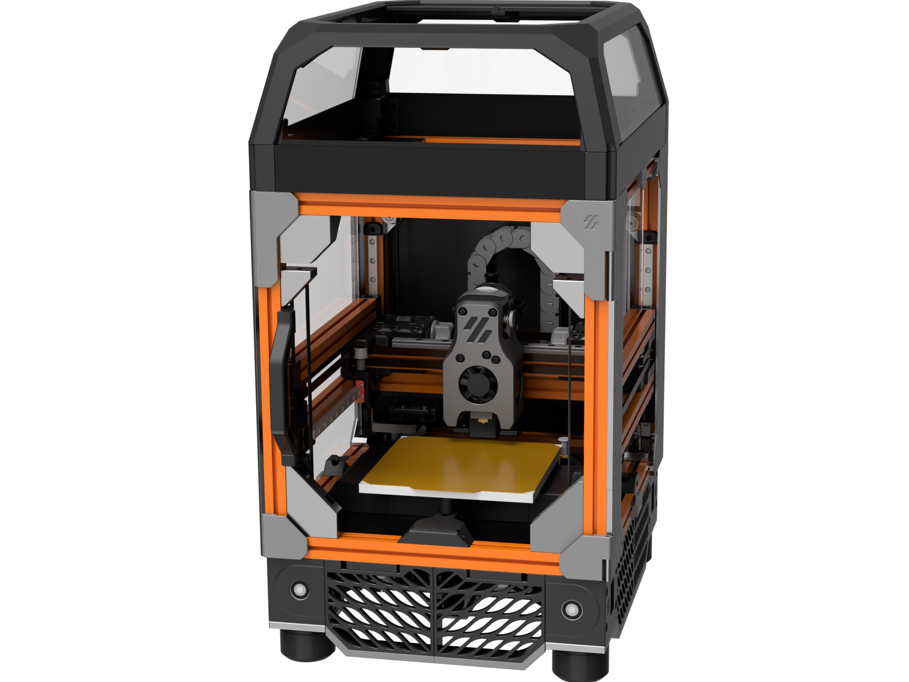

# F-Zero by Zruncho - an Evolved Voron Zero
### Upgrade your V0 or build a fresh F0.  
### Full auto-calibration at a fraction of the price of a V2.  
### Make every first layer perfect!

Join us on the [DoomCube Discord](https://discord.gg/DASuYj9F) for the latest info and any questions!

### Buildlog and Design Doc

[See the Assembly Manual and Buildlog Gdoc](https://docs.google.com/document/d/1dm8itefYrLIsCcOQht9sdMzrXE8Jk30s56c9IwtRCkM/edit#heading=h.c4f5tznx0p31) for more details.

While the printer is in development, this Gdoc is the source of truth.

Find a changelog, highlights, and more there.

### Parts in this Repo

In this repo are all the STLs you need to make an F-Zero, except for:
- Voron 0.0 or 0.1 parts, including gantry, toolhead, carriage retainers, tophat, and M2 nutbars
- Z endstop (see #micron-v2 on DoomCube Discord)

All parts should be already be in print-ready orientation, and no supports are needed.

Standard Voron settings, or lowered infill and fewer perims, should work fine for most parts:
- 3-4 perimeters
- 16-40% infill, depending on the part
- 0.4-0.5mm width
- 0.2mm layer height

Exceptions include:
- Frame Corners: print at 5 or 6 perimeters, 10% infill, 0.16mm layer height (seriously)
- Electronics Mezzanine Spacers: print at 3 perimeters, 0% infill, 0.2 layer height
- NoDropNuts: print at 3 perimeters, 0% infill, 0.2 layer height

### Frame Corners

Note that for the frame corners, on 2021-07-18, new _24 versions were added,
with improvements.  The 24 refers to 24mm, for the offset from the top of the
printer to the top of the vertical extrusion.  Previously it was 25mm, which
matched a 250mm height for a BlindJoints F0 made with 250mm vertical extrusions.
However, the normal V0 has a 248mm height, from 200mm vertical extrusions
plus plastic parts on top.  By changing to a 24mm offset, stock V0 enclosure
clips can be used and should fit exactly.
